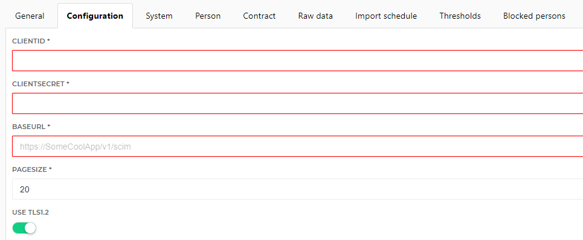

# HelloID-Conn-Prov-Source-Generic-Scim

## Introduction

The _'HelloID-Conn-Prov-Source-Generic-Scim'_ connector is a working example source connector based on scim based API's. http://www.simplecloud.info.

## Prerequisites

- When using the HelloID On-Premises agent, Windows PowerShell 5.1 must be installed.

- When the connector needs to be modified, make sure to have installed VSCode/PowerShell extension.

## Getting started

This connector is a working example for a scim based API.

> Although this is a working example, changes might have to be made according to your own environment.

Before implementing the connector in HelloID, make sure to test the connector in VSCode.

### PowerShell functions

The _persons.ps1_ file contains a few functions. All of which contain basic comment based help.

The functions that are available in version _1.0.0.0_:

- Get-GenericScimUsers
- Get-GenericScimOAuthToken
- Invoke-GenericScimRestMethod
- Select-GenericScimUserProperties
- Resolve-HTTPError

The most important function is 'Select-GenericScimUserProperties'. This function is responsible for flattening out a user object with nested hash table's and / or array's to a flat object that can be imported in HelloID. This is also the function that will require editing of more attributes are required. At this point, only a few basic attributes are imported.

### Supported PowerShell versions

The connector is created for both Windows PowerShell 5.1 and PowerShell Core 7.0.3. This means that the connector can be executed in both cloud and on-premises using the HelloID Agent.

> Older versions of Windows PowerShell are not supported.

## Setup the PowerShell connector

1. Make sure you have access to the scim based API for your application.

2. Add a new 'Source System' to HelloID.

3. On the _System_ tab, click __Custom connector configuration__ and import the code from the _configuration.json_ file.

4. Copy and paste the code from _persons.ps1_ to the PowerShell script (persons) pane.

5. Go to the _Configuration_ tab and fill in the required fields.

| Parameter         | Description                                                  |
| ----------------- | ------------------------------------------------------------ |
| ClientID          | The ClientID for the SCIM API                                |
| ClientSecret      | The ClientSecret for the SCIM API                            |
| Uri               | The Uri to the SCIM API. <http://some-api/v1/scim>           |
| IsConnectionTls12 | Enables TLS 1.2 (Only necessary when using Windows PowerShell 5.1)        |
| PageSize          | The pagesize used for the SCIM endpoint. You will find this information within the API reference documentation |
